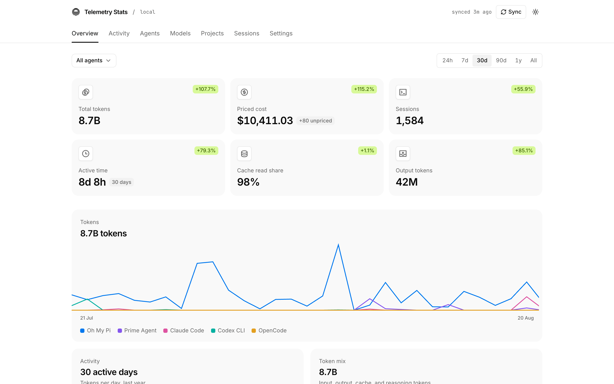

# @telemetry-dev/stats

Local web dashboard for token usage across AI coding agents. One command
scans the agent logs on your machine, stores normalized usage in a local
SQLite database, and opens a dashboard in your browser. Nothing leaves your
machine.



## Usage

```bash
npx @telemetry-dev/stats            # sync, start the dashboard, open browser
npx @telemetry-dev/stats --json     # sync and print stats as JSON
npx @telemetry-dev/stats --sync     # sync and print a summary
```

Options: `--port <n>` (default 3847), `--host <addr>` (default 127.0.0.1),
`--no-open`, `--help`. A port held by another Telemetry Stats dashboard is
reused; a port held by anything else is skipped for the next free one.

## Supported agents

Claude Code, Codex CLI (incl. Sakana Fugu), Gemini CLI, OpenCode, Amp, Droid,
Pi, Oh My Pi, Qwen CLI, Kimi, Mux, Grok Build, OpenClaw, Prime Agent, Senpi,
Kimchi, Reasonix, Gajae-Code, Jcode, Junie, Augment Code, OpenCodeReview,
CodeBuddy, WorkBuddy, Cherry Studio, Command Code, DeepSeek Harness, Codebuff,
Freebuff, Hermes, Kilo CLI, Goose, Zed, Kiro, Antigravity CLI, MiMo Code,
ZCode, Devin CLI, Devin Desktop, Octofriend (incl. Synthetic), Crush, Cline,
GitHub Copilot CLI, Roo Code, Kilo, and — via local usage caches — Cursor,
Google Antigravity, Trae, Warp/Oz, and MiniMax Code.

## Data and privacy

- Only usage metadata is stored: agent, model, provider, session id, project
  path, timestamps, token counts, and costs. Never prompts, completions, tool
  arguments, or credentials.
- Data lives in the platform data directory (`~/Library/Application
  Support/telemetry-stats` on macOS, `$XDG_DATA_HOME/telemetry-stats` on
  Linux, `%LOCALAPPDATA%\telemetry-stats` on Windows).
- Costs recorded by an agent are kept as reported. Other events are priced
  from a locally cached [models.dev](https://models.dev) catalog and marked
  "estimated"; unresolved models stay "unpriced" and are never folded into a
  total silently.

## Development

```bash
npm install
npm run dev        # vite dev server
npm test           # vitest
npm run typecheck
npm run build      # nitro server + client + headless CLI to .output/
node bin/telemetry-stats.mjs --no-open
```
